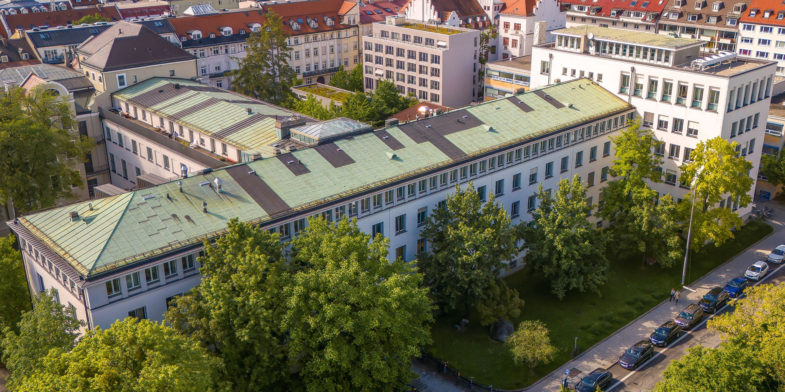

# 📬 Contact

Dr. Thanh-Noi Phan  
Department of Geography  
Ludwig-Maximilians-Universität München (LMU)  
Luisenstraße 37  
80333 München  
Germany  

📞 +49 (0)89 2180-6748  
✉️ [Phan.Noi@lmu.de](mailto:Phan.Noi@lmu.de)  

---

## 🌐 Find me on:

---

## 🗺️ Directions

You can find me at the Department of Geography, LMU Munich:  
**Luisenstraße 37, 80333 München, Germany**  
Google Maps link: [📍View on Google Maps](https://www.google.com/maps?q=48.138967,11.567185)

---

## 🏢 Department Building

  
Department of Geography © LMU
